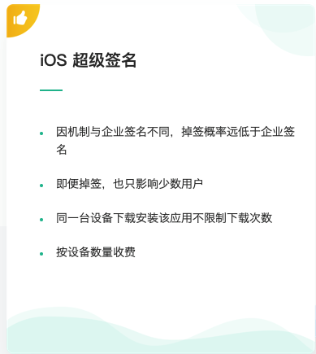
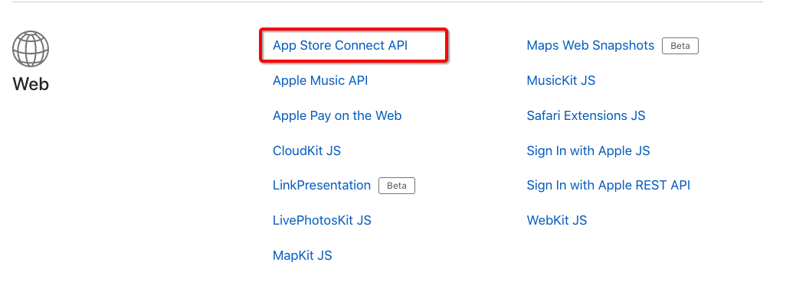
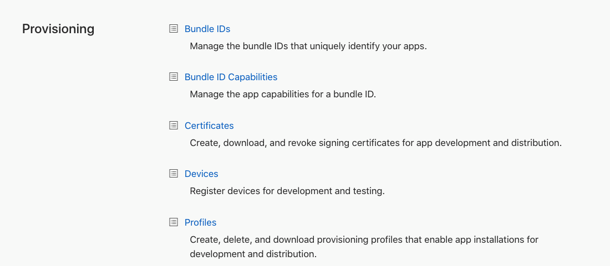
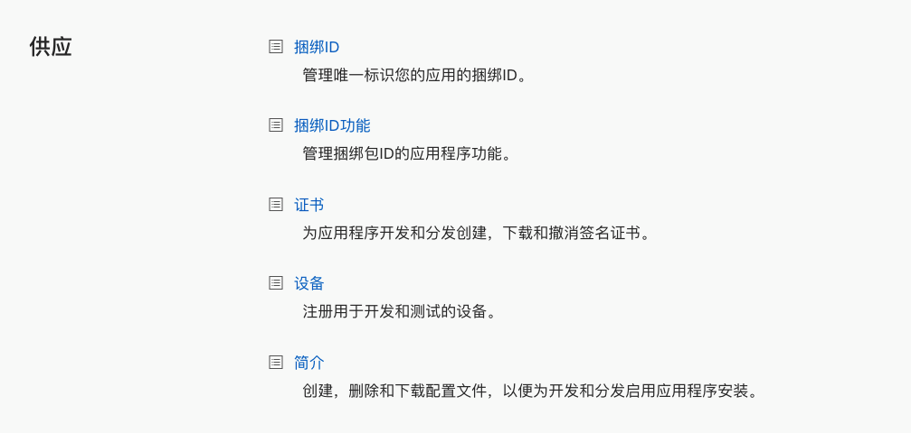
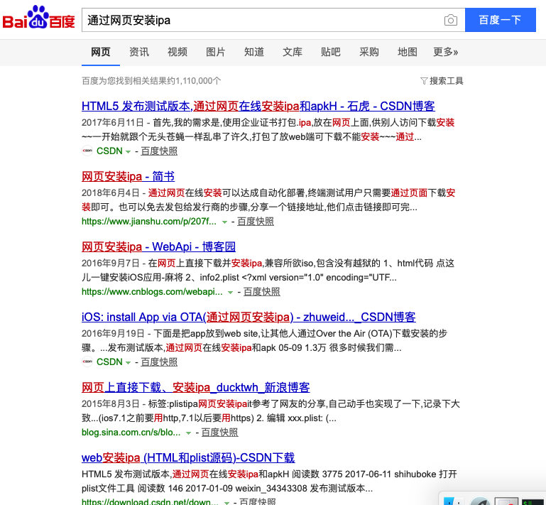

# 超级签名实现步骤详解

### 超级签名是什么

图中可以看出几个重要信息 
1、机制与企业签名不同 
2、会掉签 
3、同一台设备可以无限制下载次数 
问: 那么同时满足这三点是什么? 
答: 通过添加设备UDID进行安装的测试版IPA

### 如何操作
通过上文我们得出结论, 超级签名其实就是通过将设备的UDID写入到开发者后台,然后生成一个存在当前设备UDID的IPA对设备进行安装,那么就会产生以下几个问题: 
1、如何获取UDID  
2、如何将UDID写入开发者后台 
3、如何将带有UDID的测试证书写入到IPA 
4、如何安装新的IPA 
上面的问题我们接下来一个一个解决,首先第一个, 
`如何获取UDID?` 
这里我们依靠强大的互联网搜索技术, 找到一篇讲解如何获取UDID的文章, 那就是[天狐大佬的文章](https://github.com/shaojiankui/iOS-UDID-Safari),文章中详细的讲解了如何通过`.mobileconfig`配置文件获取设备UDID, 
[获取UDID测试网址](http://dev.skyfox.org/udid/) 
第二个问题`如何将UDID写入开发者后台` 
想要回答这个问题... 那就要聊到[苹果大大曾经公开的一部分接口了](https://developer.apple.com/documentation/)

点进去就会发现`踏破铁鞋无觅处 得来全不费工夫`

我的天... 都是英文... 这里容我说一句<h4>谷歌牛逼~~~</h4>

根据这份文档我们就可以轻松实现将UDID写入开发者后台这一步骤, [本菜鸡根据官方文档通过python实现的小demo](https://github.com/iizvv/its/blob/master/itsUtils.py)
第二个问题到此就算解决了.OK, 我们继续说第三个问题`如何将带有UDID的测试证书写入到IPA`, <h4>核心、核心、核心...</h4>这就是整个流程中最重要的环节, 然而本菜鸡能力有限, 只能使用别人搞好的东西(心塞塞...)

第三个问题解决... 好像有点虎头蛇尾啊... 不管了. 继续最后一个问题`如何安装新的IPA`, 这个问题准确的描述应该是:`如何通过网页安装重签名之后的IPA`, 其实解决方案和获取UDID一样, 那就是强大的互联网搜索技术 满屏都是我们要的东西, 随便找一个点进去就好了

##### 完美抛出的问题全部解决(算是全部解决吧...)